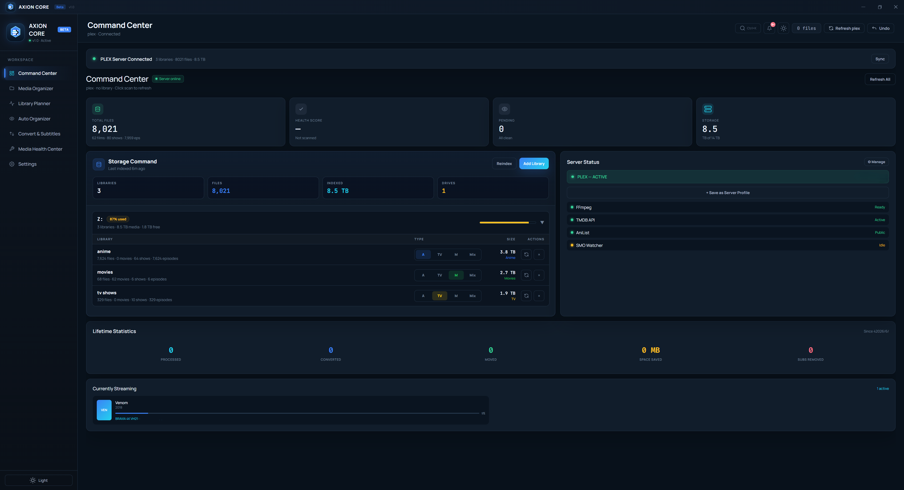
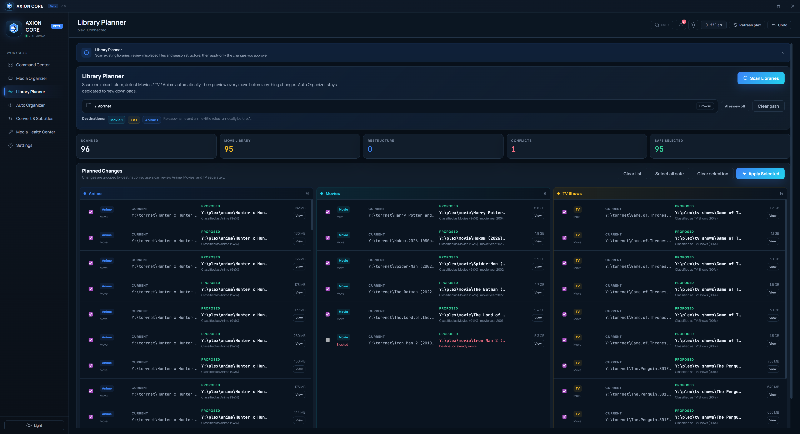

# AXION CORE

**AXION CORE** is a Windows desktop media server manager for Plex, Jellyfin, and Emby libraries.

It helps you clean mixed folders, rename media files, detect Movies / TV / Anime, plan safe library moves, review subtitles/audio tracks, and preview every change before anything touches your files.

Website: https://axioncore.app  
Support: support@axioncore.app

---

## Preview

### Command Center

### Library Planner

---

## Current Beta

AXION CORE is in Windows beta. The beta includes a free mode for testing the workflow, plus a **Pro Lifetime** license for full-library use.

- **Free Beta**: preview the app, test small batches, and confirm that the workflow fits your server.
- **Pro Lifetime**: unlock large batches, full Library Planner, batch convert, Media Health auto-fix, AXION AI Advisor, and one-device Pro activation.

---

## Core Workflows

### Command Center

Monitor server status, storage, pending actions, library totals, and health signals from one control surface.

### Media Organizer

Scan a folder, match files with TMDB/AniList, preview current vs proposed names, group results by Movies / TV Shows / Anime, then apply only what you approve.

### Library Planner

Clean an existing mixed library. AXION CORE scans the selected folder, detects misplaced Movies / TV / Anime, shows grouped destination plans, flags conflicts, and lets you apply safe moves with undo support.

### Auto Organizer

Watch your download folder after your library is configured. New files can be detected, cleaned, converted when needed, and moved into the right destination.

### Convert & Subtitles

Remux videos to MKV, keep/remove subtitle and audio tracks, add external `.srt` / `.ass` subtitles, and batch process media with preview controls.

### Media Health Center

Review bad names, duplicates, empty folders, low-quality files, old large files, and AI-assisted repair suggestions from one health-focused workflow.

### AXION AI Advisor

Use local AI through Ollama when available, with optional cloud AI providers. AI can assist with difficult mixed folders, messy release names, and library repair suggestions.

---

## Why AXION CORE Exists

AXION CORE is built for people who already have media files and want a safer way to structure them.

It is useful for:

- Messy download folders
- Mixed Movies / TV / Anime libraries
- Incorrect episode names
- Wrong season structure
- Anime episode-to-season mapping
- Subtitle and audio track cleanup
- Large Plex / Jellyfin / Emby libraries
- Preview-first cleanup before moving files into a server library

---

## What AXION CORE Is Not

AXION CORE does **not** provide media, download media, index torrents, or replace Sonarr/Radarr.

It complements your existing setup by focusing on cleanup, structure, preview, repair, conversion, and undoable organization.

---

## Download

Download the latest Windows beta from:

https://axioncore.app

Or use GitHub Releases:

https://github.com/axion-core-app/axion-core-download/releases

Use the installer for normal installation, or the portable build if you want to test without installing.

---

## Safety

AXION CORE is designed around a preview-first workflow.

The app shows proposed changes before applying them, and applied operations are logged for undo/history.

Because this is beta software, test it first on a small folder or copied sample before applying changes to a full production library.

---

## Feedback

This beta is shaped by real-world library testing. Please report:

- Detection mistakes
- Wrong season mapping
- Rename issues
- Library Planner conflicts
- UI bugs
- Missing workflows
- Feature requests

Open a GitHub issue or email:

support@axioncore.app

---

## Supported Platforms

Current beta:

- Windows 10 / 11 x64

Planned after Windows launch stabilizes:

- Linux
- macOS

---

## Status

AXION CORE is in active Windows beta.
